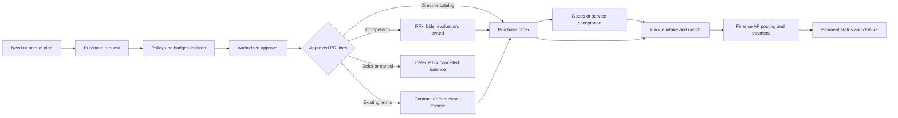

# PROC-00 Procurement Module Architecture and Capability Map

**Document type:** Module foundation and capability map<br>
**Status:** Draft for product and stakeholder review<br>
**Version:** 0.1<br>
**Prepared:** 3 October 2026<br>
**Feature documents:** all current child drafts are listed in the [documentation index](README.md).

This is the master map for documenting Procurement. It fixes the module boundary, proposed parent features, cross-module ownership, core workflow, and documentation sequence. It does **not** approve thresholds, tax treatment, delegated authority, technical interfaces, or implementation. Each child feature must receive the ERP's [28-section specification](../hrm/feature-specifications/ERP_Feature_Specification_Framework_Enterprise_Integration_Updated.docx) before development.

## 1. Purpose and outcomes

Procurement controls the commercial path for acquiring goods, services, subscriptions, and assets:

```text
Need → Request → Approval and budget decision → Sourcing and selection
     → Purchase order → Delivery or service completion → Inspection and acceptance
     → Invoice validation → Finance/AP handoff → Payment visibility → Closure
```

It should prevent unapproved or off-contract spend, make decisions and exceptions traceable, guide employees and suppliers through their tasks, and make ordered, accepted, invoiced, and paid amounts distinguishable. Payment execution, stock valuation, and asset depreciation stay with their owning modules.

## 2. Repository and architecture context

The ERP currently has a React HRMS frontend, an ASP.NET Core HRM API with the `hrm` PostgreSQL schema, and a Go ERP API that currently provides bootstrap, authentication, and health facilities. A bootstrap migration creates the `procurement` schema, but this repository does not yet contain a Procurement backend or frontend. The older [ERP architecture position](../00-architecture-position.md) adopts bounded modules inside one ERP deployable and predates the ASP.NET Core HRM API. The Procurement host, migration owner, and shared-service contracts therefore need an explicit technical decision before implementation.

Use bounded ownership regardless of the chosen host: Procurement owns its transactions and schema, reaches other modules through versioned contracts, and never reads another module's tables. Workforce identity, tenant/entity scope, authorization, documents, notifications, audit, search, workflow, and integration operations should be shared ERP capabilities when available; Procurement defines its domain rules on top of them. The current repository must be assessed against each dependency rather than assuming these shared capabilities are already implemented.

## 3. Documentation hierarchy and identifiers

```text
ERP → Procurement module → Parent feature → Child feature → Operation or scenario
```

`PROC-00` is this module document. `PROC-01` identifies **Supplier onboarding and management** and `PROC-02` identifies **Purchase requisition and line routing**, as the first detailed business features. Procurement configuration uses `PROC-CFG-01`, preserving the agreed `PROC-01` and `PROC-02` sequence. The current catalogue now contains fifteen draft child specifications—`PROC-CFG-01` and `PROC-01` through `PROC-14`. All have the 28 required sections, but their open decisions and policy values still require approval. A newly proposed child must be added to this catalogue and specified before development.

The previously drafted seven-child Phase 1 specification used `PROC-01` for policy and `PROC-02` for suppliers. Those identifiers and its Phase 1 scope are superseded by this map; it remains in the [archive](archive/PHASE-1-FEATURE-SPECIFICATIONS.md) as source material, not an active contract. Its rules and acceptance criteria must be reviewed and reallocated into the new child documents, not copied blindly.

Every child document must cover, in order: identification; outcome; scope; relations; actors; triggers; preconditions; workflow; states; permissions and scope; rules; fields and ownership; views; human behaviour; notifications; documents; exceptions; integrations/APIs/events/sandbox; audit/security/privacy; reports; configuration; non-functional needs; postconditions; recovery; acceptance; tests; owners/dependencies; open decisions. Each operation or scenario must additionally identify permitted actor, transition, conditions, required data/documents, automation, SLA, escalation, error path, event, and acceptance evidence.

## 4. Parent capability map

The following are **parent features and candidate capabilities** across the full lifecycle. The linked child drafts below cover these groups; no child is ready to build until its section 28 decisions and contracts are approved.

| Parent feature | Candidate child features | Main outcome |
|---|---|---|
| A. Procurement platform and configuration | Preferences, procurement methods, categories, thresholds, approval policies, number series, transaction rules, document templates, reminders, supplier portal preferences | Versioned, effective-dated procurement policy |
| B. Items and procurement catalog | Goods/service/asset/consumable/subscription item reference, item classification, UOM, specifications, preferred supplier and price, employee catalog view, non-catalog item | Controlled description of what can be requested |
| C. Supplier management | `PROC-01` onboarding and approval, profile and sites, verification, classification, qualification, risk, suspension, performance | Approved and orderable supplier reference |
| D. Employee requests and guided buying | `PROC-02` PR and line routing, my requests/approvals, catalog request, non-catalog request, budget decision, approval | Approved, coded demand with per-line route |
| E. Procurement planning | Annual/period plan, department forecast, funding source, plan revision and utilization | Planned demand by financial period |
| F. Strategic sourcing | Direct/single-source/emergency route, RFQ, RFP/tender, supplier invitations, bids and surrogate bids, evaluation, recommendation and award | Evidence-backed supplier selection |
| G. Contracts | Contract record, signed versions, rate schedules, ceiling, framework agreement, recurring commitment, renewal, amendment, compliance | Reusable authorized commercial terms |
| H. Purchasing | Standard PO, approval/issue/acknowledgment, revision/change order, blanket PO/release, closure | Issued commercial commitment |
| I. Receiving and inspection | Goods receipt, service entry, quality inspection, partial acceptance, rejection/return, Inventory and Asset handoff | Accepted goods or service evidence |
| J. Supplier invoices and procure-to-pay | Invoice intake, duplicate detection, two/three-way match, exceptions, credit/refund reference, Finance/AP handoff, payment status | Validated procurement evidence and Finance visibility |
| K. Supplier portal | Supplier account/profile, compliance documents, bids, PO response, delivery update, invoice/credit submission, payment status, statements, supplier-visible messages | Supplier-scoped external collaboration |
| L. Analytics, controls and audit | Policy compliance, spend and supplier analytics, savings method, maverick spend, dashboards, reports, business audit and integration reconciliation | Actionable control and performance evidence |

| Parent | Current child specification(s) |
|---|---|
| A. Platform and configuration | [PROC-CFG-01](PROC-CFG-01-PROCUREMENT-CONFIGURATION-AND-POLICY.md) |
| B. Items and catalog | [PROC-04](PROC-04-PROCUREMENT-ITEMS-AND-CATALOG.md) |
| C. Supplier management | [PROC-01](PROC-01-SUPPLIER-ONBOARDING-AND-MANAGEMENT.md), [PROC-13](PROC-13-SUPPLIER-PERFORMANCE-AND-RISK.md) |
| D. Employee requests and guided buying | [PROC-02](PROC-02-PURCHASE-REQUISITION-AND-LINE-ROUTING.md), [PROC-03](PROC-03-APPROVAL-AND-BUDGET-CONTROL.md) |
| E. Planning | [PROC-05](PROC-05-PROCUREMENT-PLANNING.md) |
| F. Sourcing | [PROC-06](PROC-06-STRATEGIC-SOURCING-AND-AWARD.md) |
| G. Contracts | [PROC-07](PROC-07-CONTRACTS-FRAMEWORKS-AND-RECURRING-COMMITMENTS.md) |
| H. Purchasing | [PROC-08](PROC-08-PURCHASE-ORDERS-AND-AMENDMENTS.md) |
| I. Receiving and inspection | [PROC-09](PROC-09-RECEIVING-INSPECTION-AND-RETURNS.md) |
| J. Invoices and procure-to-pay | [PROC-10](PROC-10-INVOICE-INTAKE-AND-SUPPLIER-ADJUSTMENTS.md), [PROC-11](PROC-11-INVOICE-MATCH-AP-HANDOFF-AND-PAYMENT-VISIBILITY.md) |
| K. Supplier portal | [PROC-12](PROC-12-SUPPLIER-PORTAL.md) |
| L. Analytics, controls and audit | [PROC-14](PROC-14-ANALYTICS-CONTROLS-AND-RECORD-COLLABORATION.md) |

Procurement owns category and purchase-specific policy. Shared ERP Core should own users, roles, organization structure, generic workflow execution, currencies and tax reference services, notifications, document storage, audit, global search, quick create, organization switcher, and metadata/validation infrastructure. These are target ownership boundaries, not claims that the current repository already implements them. Arbitrary executable custom functions and custom business modules are future platform options, not Procurement prerequisites.

### Item master versus catalog

An **item** is an internal reference for a good, service, asset candidate, consumable, subscription, or other purchase type. It may carry code, name, category, unit, tax reference, specifications, preferred supplier/price, lead time, stock flag, asset flag, and active state. The **catalog** is the policy-controlled employee view of eligible items and prices, scoped by entity, site, date, contract, and role. A non-catalog request is allowed only under configured rules. Inventory or Assets may own canonical stock or asset classification; the detailed item contract must settle shared ownership before build.

### Guided buying and collaboration

Employees should see My Requests, Create Request, Catalog, My Orders and Deliveries, Approvals where assigned, and status/next action. The flow asks whether they need goods, a service, an asset, or a subscription, searches approved catalog or contracts first, and then offers a controlled non-catalog path. Procurement users have operational work queues; suppliers use a separately scoped portal, never internal staff roles.

Each business record can support participants, internal comments, mentions, supplier-visible messages where permitted, attachments, and a timeline. Sharing grants only explicit record access and cannot bypass tenant, entity, field, or supplier scope. This is record collaboration rather than an unrestricted chat system.

## 5. Canonical end-to-end flow and line routing



A PR header is a summary; **each line has its own approved quantity/value, sourcing route, converted quantity/value, ordered amount, accepted amount, and closed balance**. One request may split across direct PO, RFQ/tender, contract/framework release, defer, or cancellation. Converting a line to an RFQ does not itself order it; an award or approved route creates the PO. Reconcile source line balances transactionally so concurrent conversions cannot overcommit.

Suggested PR-line states are Requested, Pending Approval, Approved, Pending Sourcing, Converted to RFQ, Awarded, Partially Ordered, Fully Ordered, Partially Accepted, Fulfilled, Deferred, and Cancelled. These are candidate states; each child specification must define allowed transitions, actor, condition, source quantity, reversal and terminal status. The PR header derives a coherent aggregate status from its lines and approval state rather than forcing a single line route onto the whole request.

### Cross-workflow transition contract

Every major transition specification includes:

| Field | Required answer |
|---|---|
| State and next state | What the record is before and after, including terminal or reversible status |
| Actor and data scope | Permission, tenant/entity/site/department/assigned-record scope and segregation conflict |
| Conditions | Effective policy, funding, supplier eligibility, source balance and required approvals |
| Required input | Fields, evidence, comments, signatures and immutable source version |
| Side effects | Task, notification, commitment, document, integration event and audit entry |
| SLA | Clock start, pause/resume, target, breach and escalation owner; escalation never auto-approves |
| Recovery | Retry key, compensation or reversal, failure owner and reconciliation evidence |

Approval strategies are configurable by transaction type: no approval only where policy permits, single, hierarchical, sequential multi-level, parallel/quorum, conditional/amount-based, and custom rule-based. The shared workflow service executes tasks; Procurement provides policies and domain conditions. A sample amount ladder is illustrative only and is not an approved threshold.

## 6. Domain rules and control baseline

The following are **candidate invariant rules**, not approved numeric policy:

| Rule | Statement |
|---|---|
| BR-PROC-001 | A PO needs approved PR line authority unless an explicitly authorized direct or emergency route applies. |
| BR-PROC-002 | A requester cannot give final approval to their own PR without an approved compensating policy. |
| BR-PROC-003 | New PO issue requires an active, approved supplier, subject to documented emergency exception. |
| BR-PROC-004 | PO quantity/value above approved line balance or material change requires new authorization. |
| BR-PROC-005 | Invoice variance above applicable tolerance cannot hand off to AP without named exception approval. |
| BR-PROC-006 | Accepted goods cannot exceed PO remaining quantity plus approved over-delivery tolerance. |
| BR-PROC-007 | Issued commercial documents, submitted bids and approved decisions are versioned or reversed; they are not overwritten or deleted. |
| BR-PROC-008 | Finance alone confirms budget reservation, AP posting and Paid status; Procurement stores references and snapshots. |

Permission and data scope are separate decisions. For example, `procurement.requisition.approve` plus **own department** does not authorize another department. Candidate scopes are Self, Assigned Records, Team, Department, Branch/Site, Business Unit, Legal Entity, Tenant/Organization, and approved cross-entity auditor view. Field scope independently protects supplier banking references, bid contents and evaluation scores. Segregation rules can block requester/final approver, supplier creator/activator, evaluator/award approver, receiver/invoice exception approver, and AP/payment-releaser conflicts. Each exception needs explicit authority and audit.

Budget control asks Finance for availability and, at the chosen point, a single authoritative reservation/commitment reference. A check without a reservation is a time-stamped advisory result, not guaranteed funding. Cancellation, PO change, return and closure release or adjust commitments through Finance and reconcile the response. No procurement-specific shadow budget balance becomes a system of record.

## 7. Ownership and integration map

| Data or capability | System of record | Procurement relationship |
|---|---|---|
| Worker, employment, reporting line | HRMS / workforce identity | Minimum stable ID and status projection; no payroll or private HR data |
| Legal entity, branch, department, location | Organization/Core when implemented; current HRMS model contains organizational records | Resolve migration/ownership before shared contracts; use stable references |
| Roles, permissions, task engine, audit, notifications, documents | Shared ERP platform target | Procurement supplies domain rules, scoped events and evidence |
| Procurement supplier profile, eligibility and category | Procurement | Versioned master and orderable status |
| Supplier AP account and verified remittance instruction | Finance | Restricted reference/verification result; no broad bank-data copy |
| PR, RFx, bid, evaluation, award, contract, PO, receipt | Procurement | Owns commercial and acceptance history |
| Supplier invoice procurement validation and match | Procurement | Immutable evidence and AP handoff |
| Budget availability, reservation, accounting, AP, payment and bank reconciliation | Finance | Request/response and status projection only |
| Stock movement, quantity on hand and valuation | Inventory | Receives accepted GRN/return facts when enabled |
| Asset register, tag, depreciation and disposal | Asset Management | Receives accepted capital-purchase facts when enabled |
| Project/job structure and budget | Project Management and/or Finance, decision pending | Uses stable project reference and budget response |

All module contracts need tenant, legal entity, source ID/version, occurred time, correlation ID, idempotency key, schema version, and explicit acknowledgement/rejection. Business facts are published only after commit. Failed deliveries appear in an operator queue with retry and reconciliation. Sandbox uses synthetic workers, suppliers, bids, budgets, invoices and payment statuses; promotion to production requires contract, authorization and replay tests. The implementation may use in-process interfaces for synchronous module calls and events for asynchronous facts, consistent with the adopted modular ERP position.

### Supplier access and surrogate bids

Supplier portal identity is isolated by supplier ID and explicit shared records. Portal users can act only on their own profile, invited RFx, issued POs, submissions, invoices, and allowed payment-status views. For suppliers using email, paper or other offline channels, an authorized buyer may enter a **surrogate bid** with source channel, received time, entered time, original evidence and actor. Submission locks the bid; later correction is a new version, not an edit or backdate. Technical and commercial bids remain sealed until the permitted opening transition.

### Recurring, blanket and adjustment concepts

A framework agreement is an approved set of commercial terms; a blanket/standing PO is a time-bound spending authorization with a ceiling and releases. They are separate records and balances. A recurring procurement commitment captures supplier, contract, schedule, expected amount, owner and renewal; Finance owns recurring bills. Procurement records commercial reasons for supplier credit, refund due and return; Finance owns credit posting, application to AP and cash receipt.

## 8. Shared user experience, documents and operations

Procurement plugs into ERP global search, quick create, saved views, recent records, notifications and entity/site switcher when those platform facilities exist. It must still enforce scope in API, search, export, link preview and attachments. Each list/detail shows status, owner, next action, age or SLA, related records and a permission-filtered history. State labels distinguish requested, approved, ordered, accepted, invoiced, AP-posted and Finance-paid.

Document classes include supplier registration and diligence evidence; specifications; quotations and bids; evaluation sheets; award decisions; contracts; issued PO versions; delivery notes; inspections and service certificates; invoices and credits. Store version, classification, access scope, scan result, expiry date where applicable, audit reference, retention and legal hold. Sensitive material must not be placed in broad email/SMS/WhatsApp notifications. External messaging channels require explicit configuration and policy.

Record collaboration supports internal notes, mentions, supplier-visible messages and document sharing with distinct audiences. Notification recipients and escalation follow assigned work, not just static roles. SLA definitions include clock, business calendar, pause conditions, target, warning and breach actions; targets are business configuration, never figures copied from a benchmark product.

Dashboards and reports should include open PR lines and approvals, active sourcing, bid participation, POs and delivery, receipts and inspection, invoice-match exceptions, supplier eligibility and performance, contract expiry/utilization, budget/commitment status, spend, off-contract/emergency/single-source activity, and integration failures. Each KPI needs numerator, denominator, period, entity, currency conversion rule, owner and source. Mixed currencies are not silently summed.

## 9. Recommended documentation and build sequence

This is a **dependency and documentation order**, not approval to implement all phases. A phase can be released only when its shared services and cross-module contracts exist or an approved controlled interim process is specified.

| Phase | Document and implementation sequence | Exit evidence |
|---|---|---|
| 0 — architecture | `PROC-00`; choose runtime, shared-service contracts, IDs and owner map | Approved module boundary and capability map |
| 1 — foundation | `PROC-CFG-01` policy; `PROC-01` supplier; `PROC-02` PR and line routing; `PROC-03` approval and budget | Proposed supplier and PR can be governed without inventing Finance balances |
| 2 — purchasing | `PROC-06` sourcing, quotation/surrogate bid, evaluation and award; `PROC-08` standard PO and revision | Approved line can route to sourcing or order with source balance trace |
| 3 — fulfillment | `PROC-09` goods/service receipt, inspection, returns and downstream handoff | Accepted evidence and downstream acknowledgements reconcile |
| 4 — procure-to-pay | `PROC-10` invoice intake and credits; `PROC-11` match, exceptions, AP handoff and payment projection | Validated invoice is accepted/rejected by Finance exactly once |
| 5 — advanced | `PROC-04` items/catalog; `PROC-05` planning; `PROC-07` contracts/frameworks/recurring; `PROC-08` blanket option; `PROC-12` portal; `PROC-13` performance; `PROC-14` advanced analytics and collaboration | Each capability has its own 28-section draft and controlled dependencies |

The catalog and guided buying information architecture must be designed with the PR, even if Phase 1 starts with non-catalog requests. The item master/catalog, portal, contract, framework and blanket scopes are separately gated before build. This avoids making one PR state stand for several unrelated line routes.

## 10. Readiness gate and decisions

Before documenting a child as implementation-ready, confirm: business owner; tenant/entity and launch countries; source of truth for every field; precise state and transition table; actor, permission, record and field scope; segregation rules; policy/version/thresholds; required documents; normal and exception paths; SLA; API/event schema and sandbox; postconditions and reconciliation; acceptance and negative/security tests. The [ERP standard](../hrm/feature-specifications/ERP_Feature_Specification_Framework_Enterprise_Integration_Updated.docx) remains the formal checklist.

Decisions needed now:

1. Confirm this 12-parent map and `PROC-01`/`PROC-02` scope and identifiers.
2. Confirm launch entity, country, currency and which types of goods/services/assets/subscriptions are included first.
3. Decide ownership of shared organization and item references while current HRMS holds organization data.
4. Select Procurement runtime, migration runner, deployment boundary and shared workflow/identity approach.
5. Name Finance budget/AP contract owners and determine whether controlled manual budget evidence is an interim path.
6. Set supplier due diligence and payment-instruction verification owners.
7. Decide catalog timing and whether an employee guided-buying shell ships with non-catalog PRs.
8. Name policy approvers and decide the first transaction types with SLAs and approval strategies.

These are tracked in child section 28; no numeric thresholds, retention periods, tax logic or service-level targets are approved by this document.

## 11. Reference and interpretation

The [Zoho Procurement product overview](https://www.zoho.com/procurement/) and [Zoho Procurement help index](https://www.zoho.com/ca/procurement/help/getting-started/welcome/) were checked for capability coverage. The help index lists items, vendors, request-line conversion, RFQs and surrogate bids, approvals, purchase receives, bills and matching, recurring bills, vendor credits, budgets, analytics, custom modules and supplier portal. It is a benchmark of possible capability, not a source of this ERP's policy or ownership. In this ERP, Finance retains AP and payment, Inventory retains stock, and shared platform capabilities remain outside Procurement.
