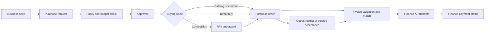

# Procurement Module Enterprise Workflow Blueprint

> **Superseded draft.** The current source of truth is [PROC-00](../PROC-00-PROCUREMENT-MODULE-ARCHITECTURE-AND-CAPABILITY-MAP.md). This earlier blueprint has a different phase sequence and remains for historical comparison.

**Document type:** Business workflow and functional blueprint 
**Status:** Draft for product and stakeholder review 
**Version:** 0.1 
**Prepared:** 3 October 2026 
**Scope:** Modular procurement capability for an existing ERP with an established HRMS

This is a configurable baseline, not an approved company policy. The business must set monetary thresholds, approval limits, tax rules, retention periods, delegated authority, and exception rules before implementation.

The [Phase 1 Feature Specifications](PHASE-1-FEATURE-SPECIFICATIONS.md) break the first release into parent and child features, operation scenarios, and the ERP's mandatory 28-section documentation framework.

## 1. Purpose and outcomes

Define workflows, records, roles, controls, and integrations from business need through supplier selection, purchase order, receipt, invoice validation, and Finance payment handoff. Procurement should give employees a consistent buying path; enforce budget and authority rules; reduce unapproved and off-contract spend; and preserve an auditable history. It should reuse HRMS identity and organization data rather than maintaining another employee master.

## 2. Scope, assumptions, and boundaries

**In scope across the planned phases:** purchase requests (PRs), approvals, budget checks, catalog and non-catalog buying, supplier onboarding, RFx sourcing, bid evaluation, contracts, purchase orders (POs), goods and service receipts, invoice matching, exception routing, payment-status visibility, notifications, audit, and spend analytics.

**Assumptions to validate:**

1. Multiple legal entities, departments, sites, currencies, and cost centres exist or will be shared ERP dimensions.
2. HRMS is the source of truth for active employees and its current organization model. Procurement consumes a controlled, minimal projection with stable identifiers.
3. Finance/AP owns the general ledger, tax accounting, payment execution, and bank reconciliation. Budget and commitment ownership must be confirmed.
4. Inventory, assets, projects, and expenses may be separate modules. Procurement uses defined contracts rather than their tables or ledgers.
5. Approval rules vary by entity, amount, category, location, transaction type, and risk. No values are prescribed here.
6. Supplier participation can begin through controlled internal entry or secure invitations. A restricted portal is a later phase unless launch scope changes.
7. E-signature, OCR, tax validation, sanctions screening, and payment rails are optional integrations.

**Out of scope:** executing bank transfers, holding payment credentials in general procurement workflows, replacing the finance or inventory ledger, administering HR recruitment or payroll, warehouse valuation, manufacturing planning, asset depreciation, and legal or jurisdiction-specific due-diligence determinations.

The repository has an ASP.NET Core HRM API and React HRM frontend. The Go ERP API currently has bootstrap and health facilities, including an empty `procurement` schema. The older [architecture position](../../00-architecture-position.md) sets module boundaries but predates the implemented HRM backend. The procurement runtime and migration owner require a decision before build. This blueprint is deployment-neutral at the business level; the implementation must respect the adopted ERP boundary.

**Name collision:** An HRMS recruitment requisition authorizes hiring. A procurement PR authorizes purchasing. Their numbers, records, routes, permissions, and workflows remain separate.

## 3. Capability architecture

| Capability | Owns | Key output or dependency |
|---|---|---|
| Foundation and policy | Numbering, categories, workflow rules, tolerances, document rules | Versioned policy decisions |
| Buying | Catalog and non-catalog PRs, coding, justification, status | Approved demand |
| Budget and commitment control | Checks, reservations, releases where Finance delegates authority | Finance-backed budget decision and commitment reference |
| Supplier management | Proposed and approved supplier profiles, qualifications, change history | Orderable supplier reference |
| Strategic sourcing | RFx, invitations, bids, evaluation, award | Approved award recommendation |
| Contracts | Agreement metadata, versions, rate schedules, renewals | Valid terms for orders and releases |
| Purchase orders | Drafts, approvals, revisions, issue, acknowledgement, closure | Commercial order to supplier |
| Receiving | Goods inspection, GRNs, service acceptance, returns | Accepted quantity or value |
| Invoice validation | Capture, duplicate checks, matching, exceptions | Validated invoice handoff to AP |
| Payment visibility | Finance status sync | Read-only payment outcome |
| Supplier portal | Supplier-submitted profile, bids, acknowledgements, invoices | Supplier-scoped participation |
| Analytics and audit | Read models, operational reports, business history | Controlled reporting and evidence |

Shared services provide identity, notifications, documents, search, and technical integration monitoring. Attachments need access control, malware scanning, versioning, and retention. Completed business audit events are append-only for ordinary users; integration delivery logs are separate.

## 4. Actors and responsibilities

| Actor | Responsibilities | Control |
|---|---|---|
| Requester | Create and track PRs; attest receipt only if permitted | Cannot approve own request by default |
| Line manager | Validate need and approve in assigned scope | Authority follows HRMS hierarchy or valid delegation |
| Budget owner | Validate funding and coding | Cannot silently override a hard budget control |
| Buyer | Manage sourcing, orders, suppliers, communication | Cannot alone approve own award or PO where segregation applies |
| Evaluation panel | Score bids and document recommendations | Declare conflicts; award approval is separate |
| Supplier administrator and supplier user | Maintain permitted profile; respond to RFx and orders | External access limited to that supplier |
| Receiver or service owner | Inspect, receive, certify, reject | Cannot over-receive without exception |
| AP processor | Validate invoice and accounting details | Cannot alone change bank details and release payment |
| Finance or Treasury | Own posting, payment and reconciliation | Returns status and reference to Procurement |
| Procurement administrator | Configure policy and templates | Changes versioned and audited |
| Auditor | Review authorized history and evidence | Read only |

## 5. End-to-end lifecycle

A PO may have multiple receipts and invoices. Services may use an authorized two-way match; goods commonly use a three-way match. Finance may reject a handoff for correction. Receipt progress and invoice progress are separate dimensions.

## 6. Detailed workflows

### 6.1 Purchase request and buying

The requester chooses a catalog item or a non-catalog line and provides description, quantity and unit, need date, location, entity, cost centre, optional project or asset reference, estimate and currency, supplier preference if any, justification, and evidence.

1. Save, edit, duplicate, or withdraw a draft. Validate active employment, coding, location, and required fields.
2. Evaluate category restrictions, preferred or blocked suppliers, contract availability, similar requests, quote requirements, and spending policy. Each result is a warning, block, or exception route according to a versioned rule.
3. Request a budget decision from the authoritative Finance source. Reserve funds only at the configured point, with one authoritative reservation and release process. A manual Finance status requires named approver, timestamp, and evidence; it must not be presented as a live budget reservation.
4. Route approval by the matrix in section 7. If lines need different coding or approvers, preserve line-level decisions and a coherent overall status. Partial approval requires an explicit business policy.
5. Route approved lines to catalog or contract release, authorized direct buy, competitive sourcing, or restricted exception review.
6. Convert approved demand into PO lines, retaining PR-line references. Material changes trigger reapproval.
7. Close, cancel, or partially order with reasons; release unused commitments where applicable.

**PR states:** Draft → Submitted → Policy Check → Pending Approval → Approved → Partially Ordered or Ordered → Closed. Alternatives: Returned, Rejected, Withdrawn, Cancelled, On Hold, Expired. Submission versions the request; material changes require return or reopen and policy re-evaluation. Every transition records actor, time, reason, and prior state.

### 6.2 Supplier onboarding and maintenance

Keep a proposed supplier separate from an approved, orderable supplier. Capture legal and trading names, registration and tax identifiers, sites, contacts, categories, declarations, qualifications, and secure remittance reference where needed. Check potential duplicates by legal identifier and normalized names; a person reviews suspected matches.

Apply due diligence by risk tier and geography. Procurement or compliance reviews eligibility; Finance independently verifies sensitive payment instruction changes through an approved channel. Approve, return, reject, or conditionally approve with review date. Changes to legal identity, tax profile, payment instructions, or risk class create a version and revalidation. Suspension or deactivation records reason, effective date, and impact on existing orders and invoices.

**Supplier states:** Draft → Submitted → Due Diligence → Pending Approval → Active. Alternatives: More Information Required, Conditional, Rejected, Suspended, Expired, Inactive. A new PO requires an active supplier unless a documented emergency policy permits an exception.

### 6.3 Strategic sourcing and RFx

Create an event linked to approved demand, category, entity, owner, schedule, supplier qualification rules, and weighted criteria. Invite eligible suppliers and record exceptions to competition. Publish specifications, terms, due date, response format, and a controlled question process. Keep submitted bids confidential until close, with timestamp and version; late bids follow explicit policy.

Evaluators declare conflicts, score independently with evidence, and separate technical from commercial review when required. Normalize total cost and non-price factors, document assumptions and negotiation changes, then route an award recommendation for distinct approval. An approved award can create a contract, PO, or both. Retain bid, evaluation, award, and supplier notification evidence.

**RFx states:** Draft → Approved to Publish → Open → Closed → Evaluation → Award Pending → Awarded or No Award; exceptional paths are Cancelled, Withdrawn, and audited Reopened. Supplier bid states include Invited, Viewed, Draft, Submitted, Withdrawn, Disqualified, Evaluated, Awarded, and Not Selected.

### 6.4 Contract lifecycle

Maintain supplier, entity, owner, category, type, effective and expiry dates, renewal notice date, price or rate schedules, ceiling, obligations, amendments, documents, and linked sourcing and orders. Route draft through review, approval, signature where required, activation, monitoring, and renewal or termination. Preserve signed versions. New terms apply only after authorization. Alert the owner before renewal and prevent drawdown beyond an approved ceiling unless an amendment or exception permits it.

### 6.5 Purchase order

Create from an approved PR, award, contract release, or explicitly authorized direct buy. Store supplier and site, entity, currency, ship-to and bill-to, buyer, payment and delivery terms, line coding, taxes, source references, and approved commercial snapshot. Check supplier eligibility, funds, contract validity, coding, and duplicate risk. Approval follows value, category, risk, and change from source authority.

Issue the approved version by controlled channel and record dispatch and supplier acknowledgment. Changes to supplier, price, quantity, scope, terms, or delivery beyond tolerance create a numbered revision and reapproval. Support multiple deliveries and, when enabled, blanket limits and schedules. Close after fulfillment and invoice resolution, or cancel the remainder with commitment release.

**PO commercial states:** Draft → Pending Approval → Approved → Issued → Acknowledged → Closed, plus Returned, Change Pending, On Hold, Cancelled, Expired, and Disputed. Track receiving and invoicing progress separately; one status cannot accurately express both.

### 6.6 Goods receipt and service acceptance

For goods, record PO line, delivery note, date, location, quantity, condition, inspection, optional lot or serial detail, actor, and evidence. Issue a GRN for accepted quantity. Manage damage, rejection, shortage, over-delivery, return, and replacement as explicit exceptions. Inventory receives accepted receipt and return facts when enabled.

For services, certify milestone or period, deliverable, dates, accepted quantity or value, and required evidence. A requester may attest only if policy permits. Multiple partial receipts are valid. Over-receipt requires authorized tolerance or exception. Corrections reverse or adjust the original record; they never overwrite it.

**Receipt progress:** Expected, Under Inspection, Partially Accepted, Fully Accepted, Rejected, Return Requested, Returned, Reversed. Service acceptance can also be Pending Certification or Disputed.

### 6.7 Supplier invoice and AP handoff

Capture invoice from portal, inbox, or controlled AP entry: supplier, entity, invoice identity and dates, currency, totals, tax information, PO lines, attachments, and credit reference. OCR can suggest fields but critical values require validated confirmation.

1. Validate required fields, supplier status, totals, entity, currency, and a normalized supplier plus invoice-number duplicate key. The exact uniqueness scope, including currency, needs Finance approval.
2. Match invoice to PO and accepted receipt where required. Two-way or three-way rules and tolerances vary by category and field; no silent global tolerance.
3. Route a clean invoice for approval or create an exception with owner, due date, discrepancy type, and evidence.
4. Resolve through a corrected invoice, PO revision, receipt adjustment, credit, partial approval, or authorized variance. Preserve original and replacement versions.
5. Send a validated, immutable, idempotent handoff to Finance/AP. Record its acceptance, rejection, posting, and payment updates. Procurement does not initiate a second payment.

**Invoice processing states:** Received → Validation → Match Pending → Exception or Pending Approval → Validated → Handed to AP. AP Rejected, Duplicate, Disputed, Credited, Cancelled, and Voided are alternatives. **Finance-owned status** separately records Posted, Partially Paid, Paid, or payment exception only when Finance confirms it.

### 6.8 Exceptions and special routes

Emergency purchase requires reason, cap, duration, designated approver, and retrospective review within a configured period. Sole source requires rationale, market evidence as applicable, conflict declaration, and approval. A hard over-budget failure blocks commitment until Finance authorizes a transfer, reservation, or explicit exception. Suspended suppliers block new orders while existing obligations receive review. Cancellation, returns, credits, and PO changes notify affected parties, update commitments through the authoritative interface, and preserve the original trail.

## 7. Approval and control framework

The policy engine considers entity, tax-inclusive value as defined by policy, category, spend type, supplier risk, sourcing requirement, budget and contract state, location, and transaction change. Candidate stages are need, funding, procurement review, award, PO, receipt, invoice exception, and supplier activation or payment-detail change. Each stage can be required, skipped, sequential, or parallel by versioned rules.

Minimum controls: prevent self-approval unless an approved small-entity compensating policy applies; detect conflicts among requester, buyer, receiver, AP processor, and payment releaser; keep delegation effective dated and within the delegator's authority; reroute material changes; require a reason on return or rejection; show pending quorum; escalate overdue tasks without auto-approval; and record the policy version on each decision.

## 8. HRMS and ERP integration boundaries

| Owner | Procurement consumes | Procurement publishes |
|---|---|---|
| HRMS and workforce identity | Stable employee ID, active status, work contact, entity, department, manager, work location, permitted cost-centre or project references | Optional task links; no purchase write-back to HRMS by default |
| Finance, GL, AP | Budget decisions and reservation IDs, valid coding, AP acceptance, posting and payment status | Approved commitments, releases, validated invoice handoffs, reversals |
| Inventory | Item, unit, and site references | Accepted GRN and return facts |
| Assets and projects | Asset and project codes, ownership and budget decisions | Capital purchase and project-spend references where enabled |
| Shared platform | SSO/MFA, notifications, documents, audit and monitoring | Scoped events, tasks, attachments, delivery status |

Use stable IDs, minimal field projections, versioned contracts, correlation IDs, idempotency keys, retries, reconciliation, and visible failed deliveries. An inactive employee promptly loses new-action access, but historical decisions remain attributed. Open tasks need a reassignment policy. Do not copy payroll, national identifiers, or unrelated HR details. Supplier bank data stays in a restricted Finance-owned or jointly governed channel, never in general procurement views. Modules do not read or write one another's tables.

## 9. Core record model

Candidate records: OrganizationRef, LegalEntityRef, SiteRef, CostCenterRef, ProjectRef, EmployeeRef; Supplier, SupplierSite, SupplierContact, Qualification, Change and RiskReview; Category, Catalog, CatalogItem, UnitOfMeasure, TaxCodeRef and PaymentTermRef; PurchaseRequest and PRLine; PolicyEvaluation and ApprovalInstance/Step; SourcingEvent, Invitation, SupplierBid, Evaluation and Award; Contract, Version, RateSchedule and Amendment; PurchaseOrder, POLine, Schedule, Revision and Acknowledgment; Receipt, GRNLine, Inspection, ServiceAcceptance and Return; SupplierInvoice, InvoiceLine, MatchResult, Exception and CreditNoteRef; BudgetCommitmentRef, FinanceHandoff and PaymentStatusRef; Attachment, Comment, Notification, AuditEvent and IntegrationEvent.

Each owned business record has tenant scope, stable ID, human-readable number where useful, owner, timestamps, state, version, source references, and currency for money. Approved or posted records are cancelled, reversed, or closed with a reason rather than deleted. `Ref` names indicate external ownership and should not become duplicated master-data tables by default.

## 10. Notifications, audit, and reporting

Send actionable notices for approvals, returns, budget failures, RFx deadlines, supplier questions, awards, order issue and acknowledgment, late delivery, receipts, invoice exceptions, AP rejection, payment updates, and contract renewal. Links must resolve through authorization; email should omit bank and sensitive supplier data.

Business audit captures actor, role context, action, time, prior and new state, changed fields, reason, policy version, attachment reference, and correlation ID; session metadata is included where available and appropriate. Application roles cannot alter completed audit events. Retention and legal hold follow approved policy.

Minimum reports cover PR volume and approval aging; PO cycle time, commitments, and delivery; sourcing coverage and contract utilization; supplier onboarding and expiring qualifications; invoice match rate, exceptions, and AP rejection; spend by entity, category, supplier, department, project, contract, and period; and off-contract, sole-source, or emergency spend. Define KPI numerator, denominator, time window, currency conversion, and owner before publication. Mixed currencies are not silently summed.

## 11. Non-functional and operational requirements

Enforce tenant, entity, site, category, and supplier scope on server reads, writes, search, attachments, and exports. Support SSO/MFA, encryption, restricted secrets and financial data, locale-aware dates/currencies/units/taxes, accessible responsive workflows, retries and reconciliation, scanning and retention of documents, backups, and operator-visible integration failures. Set performance and recovery targets after expected users, entities, transaction volume, and document sizes are known.

## 12. Delivery phases and acceptance

**Phase 1 — Controlled purchasing foundation:** HRMS identity and organization sync; policy configuration; PRs; Finance budget decision or controlled evidenced manual check; approvals; basic supplier master; POs; receipts and service acceptance; invoice capture and basic two- or three-way match; AP handoff; audit, notifications, and essential reports.

**Phase 2 — Strategic and supplier self-service:** supplier portal; RFx and bid evaluation; contracts and renewals; catalog and contract buying; advanced qualification; automated invoice capture; richer analytics; Inventory and asset events.

**Phase 3 — Optimization:** demand aggregation, category planning, advanced sourcing analytics, supplier performance, predictive alerts, automated risk checks, and additional country or entity rules after governance approval.

Phase 1 is accepted when:

1. An active HRMS employee can submit a coded PR; an inactive employee cannot start one.
2. Hard budget or policy failures block progress until an authorized, evidenced exception resolves them.
3. Routing follows configured organization and authority, blocks self-approval, and records reason, time, and policy version.
4. Approved demand creates a linked PO; unapproved or cancelled demand cannot.
5. Material PO changes retain revisions and trigger reapproval.
6. Multiple partial receipts calculate remaining quantity; over-receipt and rejection use controlled exceptions.
7. Invoice matching detects duplicates and configured discrepancies, each with an owner and resolution history.
8. Finance accepts or rejects an idempotent invoice handoff without duplicate posting.
9. Staff can reconstruct who requested, approved, ordered, received, matched, and handed off a transaction using the audit trail.
10. Tenant and entity boundary tests cover records, attachments, search, and exports. Supplier isolation is additionally tested when the portal launches in Phase 2.

## 13. Decisions before configuration and build

1. Which entities, countries, currencies, tax regimes, and policy sets launch first?
2. What is already implemented for Finance/AP, Inventory, assets, and projects, and who owns each record and budget reservation?
3. Which categories require competition, how many quotes, and what delegated approval limits apply?
4. Is supplier self-service needed at launch, or is controlled internal entry sufficient initially?
5. Are catalogs, blanket POs, subscriptions, recurring services, and contract releases needed in Phase 1?
6. What rules govern requester receipt, partial approval, emergency and sole-source buying, and over-budget exceptions?
7. What retention, audit, data residency, and signature requirements apply?
8. Which HRMS fields and API or event mechanism will be used, and how are open approvals reassigned after worker or manager changes?
9. What Finance/AP handoff and payment-status contracts will be used?
10. Which backend runtime and migration tool own Procurement in this repository?
11. What user volumes, performance targets, recovery objectives, and go-live date apply?

## 14. Reference benchmark

The [Zoho Procurement overview](https://www.zoho.com/procurement/procurement-management/) was checked as a capability-coverage benchmark for buying, sourcing, suppliers, contracts, orders, invoice visibility, budgets, and analytics. This blueprint defines independent workflows and ERP boundaries; it does not adopt Zoho-specific behavior or implementation.
